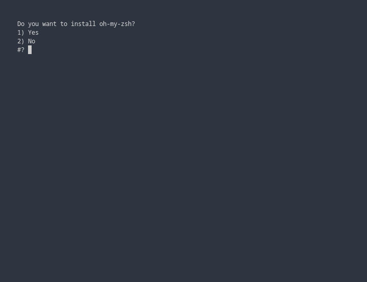
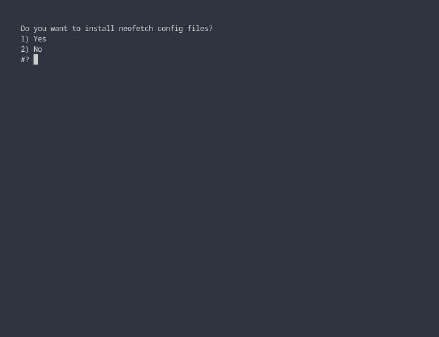

Adam's Arch Linux Dotfiles
===

These files will have been tested on Arch Linux, Void Linux and Ubuntu 20.04


**TO INSTALL**  
---
 
 Included in this repository is an install script that should work on all Linux distros.

Run the following commands to install:

```
$ git clone https://github.com/adam-burke0/dotfiles
```
*This clones this repository to a folder called "dotfiles"*


```
$ cd dotfiles
```
*This changes the working directory to the dotfiles repository*


```
$ chmod +x ./INSTALL
```
*This makes the install script executable*

```
$ ./INSTALL
```
*This runs the install script which will give you options on which files you want to install*


**Step 1**

Choosing the "Yes" option installs [oh-my-zsh](https://github.com/ohmyzsh/ohmyzsh) from it's GitHub repository


**Step 2**

Choosing the "Yes" option installs my .zshrc and .zprofile files


**Step 3**

Choosing the "Yes" option install install my kitty terminal config files


**Step 4**

Choosing the "Yes" option install install my neofetch config files


